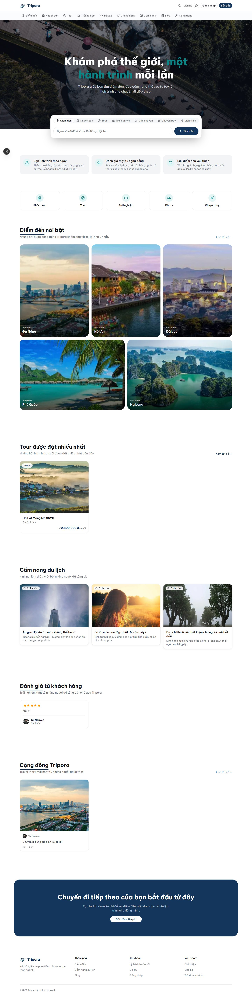
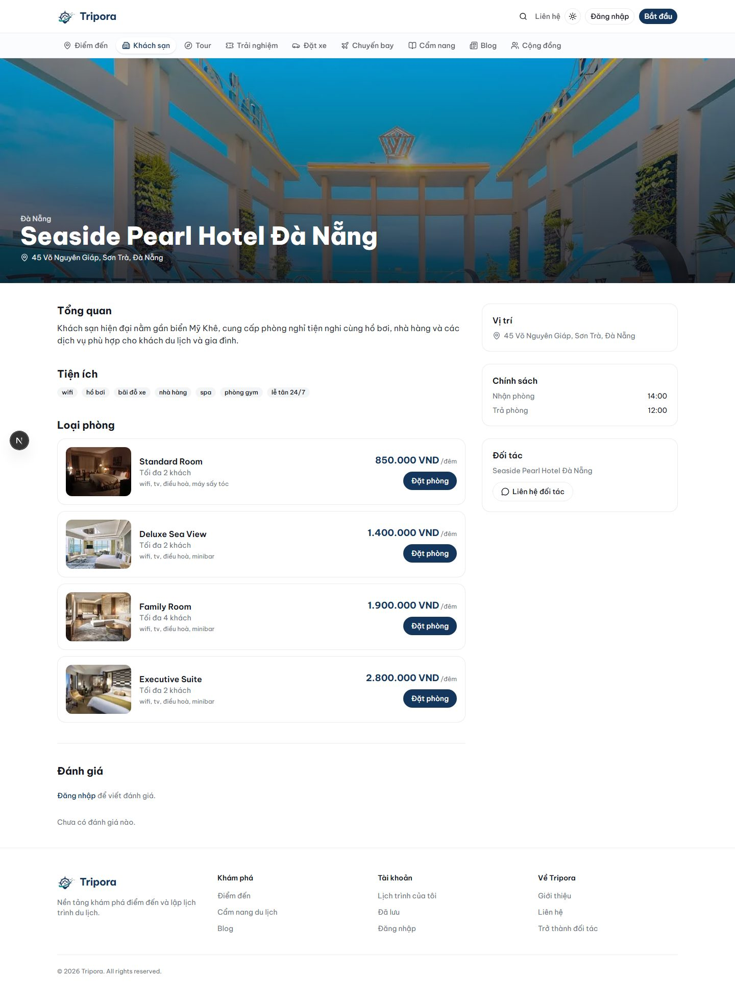
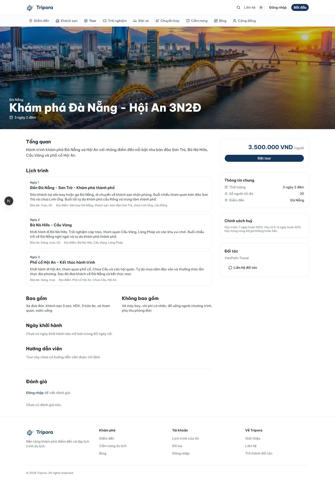
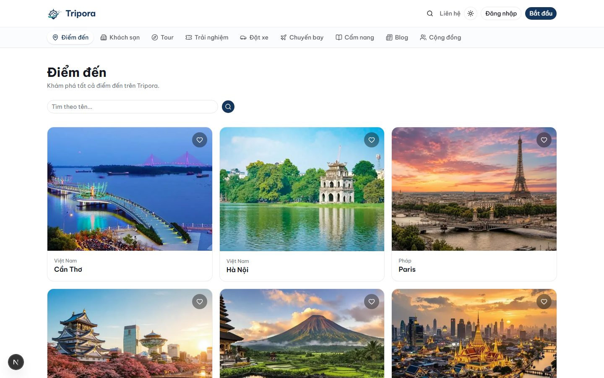

# Tripora — Frontend

The customer-facing web app for **Tripora**, a full-stack travel marketplace — discover destinations, plan trips, and book hotels, tours, experiences, ground transport, and flights, with real Stripe checkout and a social travel community. Built with Next.js App Router across 9 shipped development phases (V1 → V9).

Part of a 3-repo system: this app, the [backend API](https://github.com/nguyendotai/Tripora-backend), and an [admin/provider dashboard](https://github.com/nguyendotai/Tripora-admin).



## Highlights

- **5 booking verticals, one consistent flow** — Hotel/Room, Tour, Experience, Transport, and Flight, each with availability-aware date/seat selection and real Stripe Checkout redirect.
- **Server Components for data, Client Components only where interaction demands it** — search forms, review forms, and realtime widgets are the deliberate exceptions; everything else renders on the server.
- **Client-side search navigation with route-level skeletons** — search/filter forms use `router.push()` instead of native form submission, so results stream in under a `loading.tsx` skeleton without a full page reload or replaying the intro animation.
- **Realtime** — Socket.IO-backed notifications and a full traveler ↔ provider chat inbox.
- **Social layer** — a community feed (posts with photos), likes, follows, comments, and saved posts.
- **Personalization** — a login-gated "Recommended for you" destinations section, computed from wishlist/booking/review history.
- **Auth** — email/password and Google Sign-In, with automatic silent token refresh (including recovery when a role changes mid-session).

## Tech Stack

| Layer | Choice |
| :--- | :--- |
| Framework | [Next.js](https://nextjs.org/) (App Router, React 19) |
| Language | TypeScript |
| Styling | Tailwind CSS v4 |
| UI Components | shadcn/ui |
| State / Data | Redux Toolkit + RTK Query |
| Forms | React Hook Form + Zod |
| Animation | Motion |
| Realtime | Socket.IO client |
| Auth | JWT (access/refresh) + Google Identity Services |

## A Few Implementation Details

- **Default images per category, not random placeholders.** A listing without a real photo falls back to one fixed, category-appropriate image (hotel/tour/experience/destination/blog/guide) instead of a random stock photo — small detail, but it's the difference between a demo that looks unfinished and one that looks intentional.
- **`ReviewTarget` as a discriminated union.** Every review call site is one of `{ propertyId } | { tourId } | { experienceId } | { flightId } | { destinationId }` — extending reviews to a new product type is a type change plus a couple of call sites, not a rewrite.
- **`GetSearchForm`**, a small client-side wrapper that intercepts form submission and pushes a query string via the router — the entire site's 9 search/filter forms share it, so client-side navigation and beacon-based search analytics come for free everywhere at once.

## Getting Started

```bash
npm install
cp .env.example .env   # set NEXT_PUBLIC_API_BASE_URL (and NEXT_PUBLIC_GOOGLE_CLIENT_ID if testing Google Sign-In)
npm run dev
```

Open [http://localhost:3003](http://localhost:3003). Requires the [backend API](https://github.com/nguyendotai/Tripora-backend) running at `http://localhost:5550` (default `NEXT_PUBLIC_API_BASE_URL`).

## Screenshots

| Hotel detail | Tour detail |
| :---: | :---: |
|  |  |

<details>
<summary>Destinations</summary>



</details>

## Project Structure

```
src/
  app/         # App Router: routes, layouts, loading.tsx skeletons
  features/    # feature-scoped API slices, components, types (booking, review, auth, ...)
  modules/     # page-level composition (home, ...)
  shared/      # cross-cutting components/services (navbar, footer, search form, analytics, ...)
  components/  # shadcn/ui primitives
```

## Scripts

| Command | Description |
| :--- | :--- |
| `npm run dev` | Start dev server on port `3003` |
| `npm run build` | Production build |
| `npm run start` | Run the production build |
| `npm run lint` | Lint |
